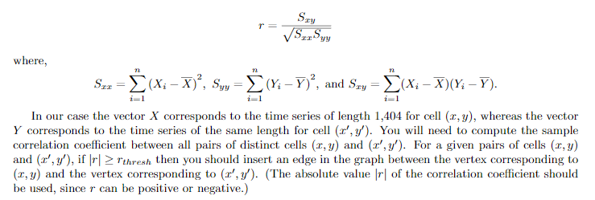

# Sea-Ice-Concentration over Beaufort Sea region
*The aim of this project was to analyze whether the graph formed my analyzing the sea ice concentration (SIC) anomaly data-set that consisted of __16 years__ (1990–2005) of weekly SIC  anomaly  data  derived  from  the  SMMR-SSM/I  passive  microwave  data  set, is a small-world-graph or not.*

* [63] x [63] grid of sensors spread over Beaufort Sea subregion = 3969 sensors
  * 3969 x 16 (years) x 52 (weeks/years) = 3302208 data points to be analyzed.
* Data files are *__binary__* `landmask` files placed in `CSE310_project_subregion` folder.
  * File name formatting `Beaufort_Sea_diffw<week_num>y<year_num>+landmask` 
    * example = `Beaufort_Sea_diffw01y2002+landmask` | week 01 for year 2002.

## Graph building 
Adjecency list was formatted as follows:

[0] -> [LinkedList of Adjecent Vertices]  
[1] -> [LinkedList of Adjecent Vertices] 
[2] -> [LinkedList of Adjecent Vertices] 
|  
|  
|  
[3967] -> [LinkedList of Adjecent Vertices] 
[3968] -> [LinkedList of Adjecent Vertices] 

An edge was added between two vertices if the `Pearsons Correlation Coefficient` value of the pair (a.k.a the `r_value`) was greater than a pre-defined `r_thresh`  
The formula for the *sample correlation coefficient*, denoted by `r` is:  

## Analysis 
* The graph was proven to be a small world graph using following analyses:
  * Histogram of the vertices degree distribution : small-world graph is characterized by a high degree of local clustering and a small numberof long-range connections.
  * *__Mean clustering coefficient__* : Calculating MCC of our graph and comparing it to a `Random` graph with the same edge density.
  * *__Characteristic Path Length__* : Calculating CPL of our graph and comparing it to a `Random` graph with the same edge density.
  * *__Component Analysis__* : Analyzing the component structure of the graph. Dense clusuters were observed.   
